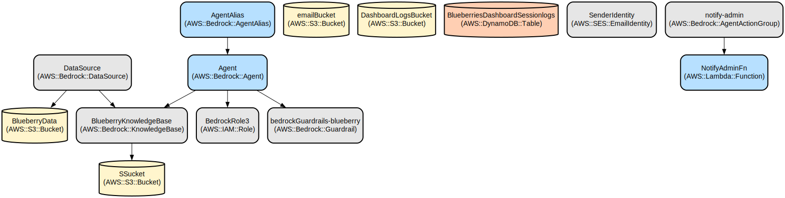

# AI-Powered Blueberry Farming Assistant with Admin Dashboard

A comprehensive chatbot application that provides real-time guidance on blueberry farming practices, powered by AWS Bedrock and featuring an administrative dashboard for content management and analytics.

This application combines natural language processing capabilities with a knowledge base of blueberry farming expertise to deliver accurate, context-aware responses to farmers' queries. The system includes a user-friendly chat interface, multilingual support, and an administrative portal for managing content and monitoring user interactions.

The application features a serverless architecture built on AWS services, with real-time communication through WebSockets, secure file management, and detailed analytics. Key features include:
- AI-powered responses using AWS Bedrock with Claude 3.5 Sonnet
- Automated email notifications for queries requiring expert attention
- Secure document management system for knowledge base updates
- Real-time chat with streaming responses
- Administrative dashboard with analytics and content management
- Multi-language support (English/Spanish)
- Session logging and analysis capabilities

## Repository Structure
```
.
├── buildspec.yml              # AWS CodeBuild configuration for CI/CD
├── cdk_backend/              # AWS CDK infrastructure code
│   ├── bin/                  # CDK app entry point
│   ├── lambda/               # Lambda functions for various services
│   │   ├── adminFile/        # Admin file management handler
│   │   ├── cfEvaluator/      # Chat flow evaluation logic
│   │   ├── email/           # Email notification service
│   │   ├── logclassifier/   # Session log classification
│   │   └── websocketHandler/ # Real-time communication handler
│   └── lib/                 # CDK stack definitions
├── deploy.sh                # Deployment automation script
└── frontend/               # React-based web application
    ├── public/             # Static assets
    └── src/
        ├── Components/     # React components for UI
        └── utilities/      # Shared utilities and contexts
```

## Prerequisites

### Common Requirements
- Node.js 20.x or later
- AWS CLI configured with appropriate credentials
- GitHub account with personal access token
- Python 3.12 for Lambda functions
- Docker for Lambda function builds

### AWS Bedrock Model Access
Enable the following AWS Bedrock models in your AWS account:
- TITAN_EMBED_TEXT_V2_1024
- ANTHROPIC_CLAUDE_HAIKU_V1_0
- ANTHROPIC_CLAUDE_3_5_SONNET_V2_0
- NOVA_LITE

To request access:
1. Navigate to the AWS Bedrock console
2. Click "Model access" in the left navigation pane
3. Click "Manage model access"
4. Select each required model in the list
5. Click "Save changes"
6. Wait for model access to be granted (usually within minutes)

### AWS Account Permissions
Ensure your AWS account has permissions to create and manage:
- AWS Lambda
- Amazon S3
- AWS Bedrock Knowledge Bases
- AWS Bedrock AI Agents
- AWS Amplify
- API Gateway (WebSocket)
- Other related AWS services

## Deployment Instructions

1. Fork the Repository:
```bash
# Navigate to https://github.com/ASUCICREPO/osu-blueberry
# Click "Fork" button
# Select your GitHub account
```

### Option 1: Using AWS CodeBuild and CloudShell

1. Open AWS CloudShell and clone your forked repository:
```bash
git clone https://github.com/YOUR-USERNAME/osu-blueberry.git
cd osu-blueberry/
```

2. Run the deployment script:
```bash
chmod +x deploy.sh
./deploy.sh
```

### Option 2: Manual CDK Deployment

1. Install AWS CDK globally:
```bash
npm install -g aws-cdk
```

2. Clone the repository:
```bash
git clone https://github.com/<YOUR-USERNAME>/osu-blueberry.git
cd osu-blueberry/
```

3. Install backend dependencies:
```bash
cd cdk_backend
npm install
```

4. Bootstrap CDK:
```bash
cdk bootstrap
```

5. Deploy the infrastructure:
```bash
cdk deploy --all \
  -c githubToken=YOUR_GITHUB_TOKEN \
  -c githubOwner=YOUR_GITHUB_USERNAME \
  -c adminEmail=YOUR_ADMIN_EMAIL \
  -c route53EmailDomain=YOUR_DOMAIN \
  -c githubRepo=osu-blueberry
```

## Usage Instructions

1. Start the frontend development server:
```bash
cd frontend
npm start
```

2. Access the application:
- Chat interface: `http://localhost:3000`
- Admin dashboard: `http://localhost:3000/admin`

### More Detailed Examples

1. User Query Flow:
```javascript
// Example chat interaction
const query = "What is the best soil pH for blueberries?";
const response = await chatbot.query(query);
console.log(response);
```

2. Admin Document Upload:
```javascript
// Upload new knowledge base document
const file = new File(['content'], 'blueberry-guide.pdf');
await adminApi.uploadDocument(file);
```

### Troubleshooting

1. WebSocket Connection Issues
- Error: "WebSocket connection failed"
  - Check AWS API Gateway WebSocket API status
  - Verify authentication token is present
  - Ensure proper CORS configuration

2. Lambda Function Errors
- Check CloudWatch Logs for specific Lambda function
- Verify IAM roles and permissions
- Monitor Lambda function timeouts

3. Knowledge Base Updates
- Confirm S3 bucket permissions
- Check Bedrock ingestion job status
- Verify file format compatibility

## Data Flow
The application processes user queries through a multi-stage pipeline that ensures accurate and contextual responses.

```ascii
User Query → WebSocket API → Lambda → Bedrock Agent → Knowledge Base
     ↑                                     ↓
     └──────────── Response ←─────── Email Notification
```

Component interactions:
1. User submits query through WebSocket connection
2. Lambda function processes request and invokes Bedrock Agent
3. Agent queries knowledge base and evaluates confidence
4. High confidence responses (>90%) are returned directly
5. Low confidence queries trigger admin notification workflow
6. Session logs are stored in DynamoDB for analytics
7. File uploads are processed and ingested into knowledge base

## Infrastructure



Lambda Functions:
- `adminFile`: Manages document uploads and knowledge base updates
- `cfEvaluator`: Evaluates chat flow and confidence scores
- `email`: Handles admin notifications
- `logclassifier`: Categorizes and analyzes session logs
- `websocketHandler`: Manages real-time communication

AWS Services:
- Bedrock: AI model and knowledge base
- API Gateway: WebSocket and REST APIs
- DynamoDB: Session and analytics data
- S3: Document storage
- SES: Email notifications
- Cognito: User authentication

Environment Variables:
- `REACT_APP_WEBSOCKET_API`: WebSocket API endpoint
- `REACT_APP_ANALYTICS_API`: Analytics API endpoint
- `REACT_APP_COGNITO_USER_POOL_ID`: Cognito user pool ID
- `REACT_APP_COGNITO_CLIENT_ID`: Cognito client ID